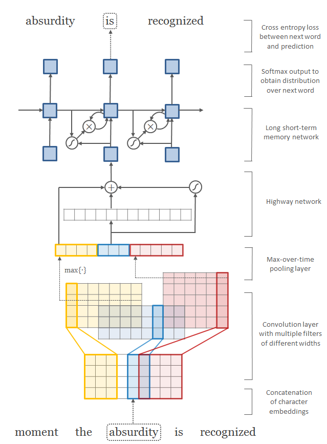

## Table of contents

1. [Task 3 - Key Information Extraction from Scanned Receipts](#task3-description)
    1. [Description](#description)
    2. [Evaluation protocol](#eval-protocol)
2. [Character-Aware Neural Language Models](#Model)
    1. [Overview](#overview)
    2. [Introduction](#intro)
3. [Training](#training)
    1. [Single CPU](#single-cpu-training)
    2. [Single GPU](#single-gpu-training)
4. [Evaluation](#evaluation)
    1. [Single CPU](#single-cpu-eval)
    2. [Single GPU](#single-gpu-eval)
5. [Results](#results)
6. [TODO](#todo)

## Task 3 - Key Information Extraction from Scanned Receipts <a name="task3-description"/>

### Description <a name="description"/>

The aim of this task is to extract texts of a number of key fields from given receipts, and save the texts for each
receipt image in a json file.

### Evaluation protocol <a name="eval-protocol"/>

For each test receipt image, the extracted text is compared to the ground truth. An extract text is marked as correct if
both submitted content and category of the extracted text matches the groundtruth; Otherwise, marked as incorrect. The
precision is computed over all the extracted texts of all the test receipt images. F1 score is computed based on
precision and recall.

## Character-Aware Neural Language Model  <a name="model"/>

### Overview <a name="overview"/>

This is a pytorch implementation of the [Character-Aware Neural Language models](https://arxiv.org/abs/1508.06615)
proposed in 2015 by:

> Yoon Kim, Yacine Jernite, David Sontag, Alexander M. Rush


The original repository implemented in [Torch library](https://github.com/torch/torch7) can be found
at [Torch lua source code](https://github.com/yoonkim/lstm-char-cnn).

### Introduction <a name="intro"/>

Here is a simple neural language model (NLM) that relies only on character-level inputs. This model employs a
convolutional neural network (CNN) and a highway network over characters, whose output is given to a long short-term
memory (LSTM) recurrent neural network language model (RNN-LM).

<div align=center></div>

Unlike previous works that utilize subword information via morphemes, this model does not require morphological tagging
as a pre-processing step. And, unlike the recent line of work which combines input word embeddings with features from a
character-level model, this model does not utilize word embeddings at all in the input layer. Given that most of the
parameters in NLMs are from the word embeddings, the proposed model has significantly fewer parameters than previous
NLMs, making it attractive for applications where model size may be an issue (e.g. cell phones).

The original predictions are made at word-level, but in this repo, the prediction was made at `text line`-level. Another
modification is the two LSTM layers that are bidirectional. The initialization of the weights are slightly differents as
well.

## Training <a name="training"/>

Here are examples of running the [train.py](./train.py).

### Single CPU <a name="single-cpu-training"/>

Be aware that it is not recommended doing to train with CPU!

```
python3 keyword_information_extraction/train.py
```

### Single GPU <a name="single-gpu-training"/>

```
python3 keyword_information_extraction/train.py --use-cuda --gpu-device 0
```

## Evaluation <a name="evaluation"/>

After having downloaded the Char LM model's weights in this [section](../README.md#results) and saved in this
location: `/path/to/the/checkpoint/pth/file`, you can do the evaluation. Note that, there is not any script for
evaluation. So it must directly be submitted on the [ICDAR19-RRC-SROIE](https://rrc.cvc.uab.es/?ch=13) competition. By defaults,
all the evaluation events (logs, submit.zip and so on) will be saved under `keyword_information_extraction/outputs`.

### Single CPU <a name="single-cpu-eval"/>

```
python3 keyword_information_extraction/evaluation.py  --trained-model /path/to/the/checkpoint/pth/file
```

### Single GPU <a name="single-gpu-eval"/>

```
python3 keyword_information_extraction/evaluation.py --trained-model /path/to/the/checkpoint/pth/file --use-cuda --gpu-device 0
```

## Experimental results and discussions <a name="results"/>

It is highly unfortunate to have so many OCR mismatched during the evaluation process (actually the test set contains
several OCR mismatches which leads to unfair results ). No matter what is the model used, the F1-score will not be the
one expected. At least here are tables showing the different results based on the recall, precision and hmean.

### Without fixing any OCR mismatches <a name="no-fixing-ocr-mismatches"/>

The result below is obtained when I did not clean the company and the address in this file: [postprocessing.py](./data/postprocessing/sroie_postprocessing.py)

|  Recall |  Precision  |  Hmean  |
| :------:| :---------: | :-------|
| 83.14 % |   83.38 %   | 83.26 % |

### Partially fixing OCR mistmatches

From the previous file mentioned above, I simply cleaned the company and the address.

|  Recall | Precision |  Hmean  |
| :------:| :-------: | :-------|
| 88.76 % |  89.08 %  | 88.92 % |

One can notice this result is about 5% better than the [previous one](#no-fixing-ocr-mismatches). The reason is that,
the company category has some unwanted strings such as `(862725 U)` which of course are not taken into account during
the evaluation protocol. To remove those mistmatches, I simply used three different regex (start at line
29: [postprocessing.py](./data/postprocessing/sroie_postprocessing.py)) to match those errors.

There are also some receipts in which the phone number is on the same line as the address (for instance, `X51007846310`)
. As it is at the end of line, I simply found the substring that starts with the word `TEL` and deleted it till the end
of the line. One may find this uncorrect, but it is unfortunate the F1-score will be lowered especially when the phone
number should normally be after the address.

### Fixing each and every OCR mistmatch

Even after fixing the company and the address, there are still OCR mismatches such as the `total` that is randomly
prefixed by `RM` or the whitespace that is randomly set within address field during the evaluation.

As the organisers of this competition do not answer to any e-mails, I compared this model with others for fair results.
One can see all the thorough changes made in this csv
file: [OCR mismatches fix](data/datasets/sroie2019/submission/fix_ocr_mismatches.csv)

|  Recall | Precision |  Hmean  |
| :------:| :-------: | :-------|
| 96.18 % |  97.45 %  | 96.81 % |


## TODO <a name="todo"/>

Here is a to-do list which should be complete subsequently.

* [ ] Support for the large model.
* [ ] Support for training with SGD optimizer.
* [ ] Support for training on word-level.