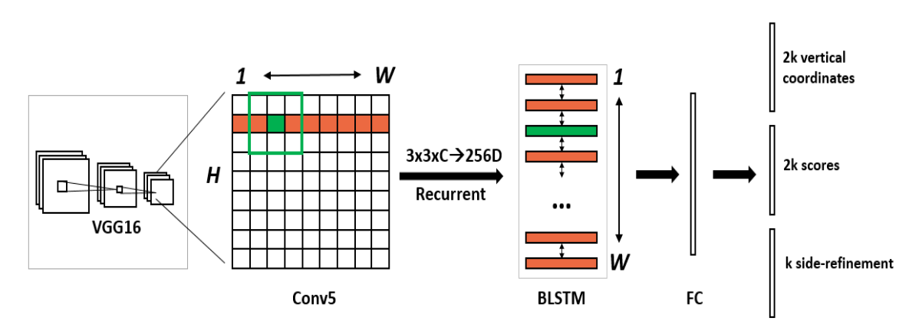
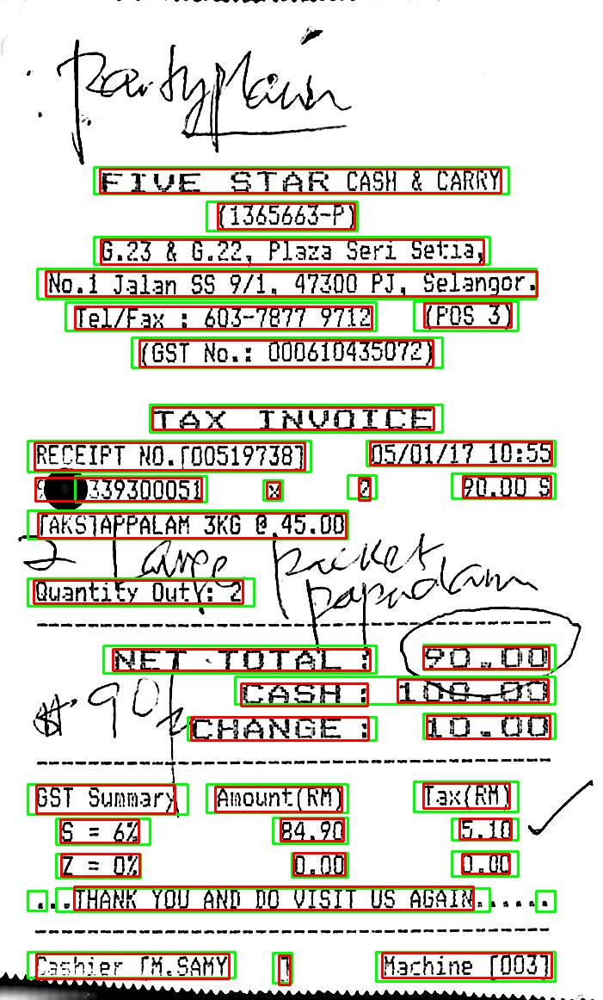
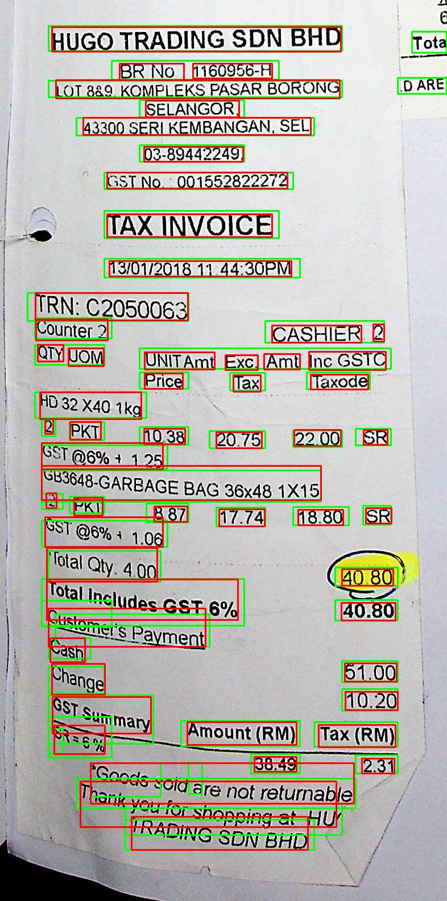
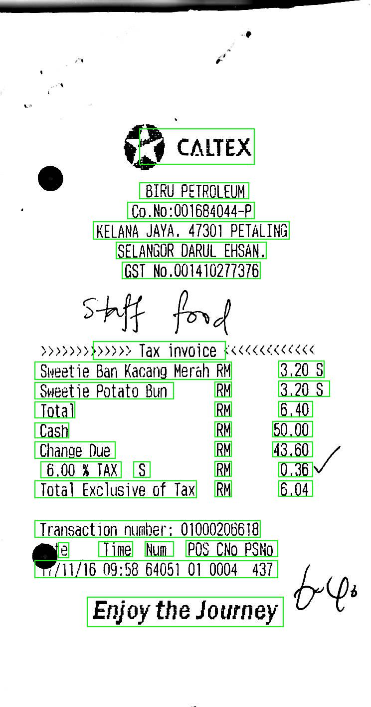
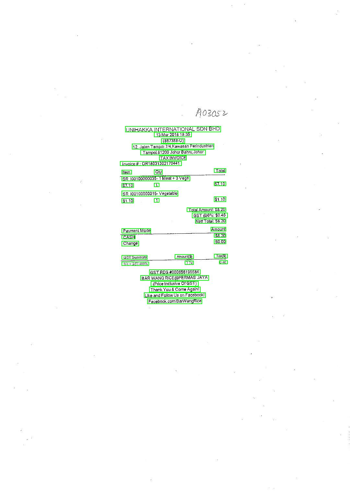

## Table of contents

1. [Connectionist Text Proposal Network](#Model)
2. [Training](#training)
    1. [Single CPU](#single-cpu-training)
    2. [Single GPU](#single-gpu-training)
3. [Demo](#demo)
    1. [Single CPU](#single-cpu-demo)
    2. [Single GPU](#single-gpu-demo)
4. [Evaluation](#evaluation)
    1. [Single CPU](#single-cpu-eval)
    2. [Single GPU](#single-gpu-eval)
5. [Discussions](#discussion)
6. [TODO](#todo)

## Connectionist Text Proposal Network <a name="model"/>

### Overview <a name="overview"/>

This is a pytorch implementation of
the [Detecting Text in Natural Image with Connectionist Text Proposal Network](https://arxiv.org/abs/1609.03605)
proposed in 2016 by:

> Zhi Tian, Weilin Huang, Tong He, Pan He, Yu Qiao.

The original repository implemented in [Tensorflow library](https://github.com/tensorflow/tensorflow) can be found
at [Tensorflow source code](https://github.com/tianzhi0549/CTPN).

### Introduction <a name="intro"/>

Here is a novel Connectionist Text Proposal Network (CTPN) that accurately localizes text lines in natural image. The
CTPN detects a text line in a sequence of fine-scale text proposals directly in convolutional feature maps. A vertical
anchor mechanism that jointly predicts location and text/non-text score of each fixed-width proposal, considerably
improving localization accuracy.

<div align=center>
   
   <p>Architecture of the Connectionist Text Proposal Network (CTPN).</p>
</div>

The sequential proposals are naturally connected by a recurrent neural network, which is seamlessly incorporated into
the convolutional network, resulting in an end-to-end trainable model. This allows the CTPN to explore rich context
information of image, making it powerful to detect extremely ambiguous text. The CTPN works reliably on multi-scale and
multi-language text without further post-processing, departing from previous bottom-up methods requiring multi-step
post-processing.

## Training <a name="training"/>

Here are examples of running the [train.py](train.py):

> Do not forget the commands to run on GPU below can be used with --use-amp argument if you want to use the automatic mixed precision.

### Single CPU <a name="single-cpu-training"/>

Be aware that it is not recommended doing the training on CPU!

```
python text_localization/ctpn/train.py
```

### Single GPU <a name="single-gpu-training"/>

```
python text_localization/ctpn/train.py --use-cuda --gpu-device 0
```

## Demo <a name="demo"/>

After having downloaded the CTPN model's weights in this [section](../../README.md#results) and saved in this
location: `/path/to/the/checkpoint/pth/file`, you can do the prediction on the images in `text_localization/demo/images`
. The predicted images with their corresponding drawn bounding boxes and annotations (in txt format) will be saved
under `text_localization/demo/results` by defauts. All the prediction events will be saved
under `text_localization/ctpn/outputs` by defaults as well.

### Single CPU <a name="single-cpu-demo"/>

```
python text_localization/ctpn/demo.py --trained-model /path/to/the/checkpoint/pth/file
```

### Single GPU <a name="single-gpu-demo"/>

```
python text_localization/ctpn/demo.py --trained-model /path/to/the/checkpoint/pth/file --use-cuda --gpu-device 0
```

You should normally get a similar output:

```
2021-10-24 11:29:03,104 Prediction phase INFO : Loading time: 49.000 ms || Inference: 261.000 ms || FPS: 4.000 || Objects detected: 44

2021-10-24 11:29:04,527 Prediction phase INFO : Loading time: 67.000 ms || Inference: 8.000 ms || FPS: 119.000 || Objects detected: 89

2021-10-24 11:29:05,561 Prediction phase INFO : Loading time: 40.000 ms || Inference: 11.000 ms || FPS: 94.000 || Objects detected: 39

2021-10-24 11:29:06,756 Prediction phase INFO : Loading time: 104.000 ms || Inference: 24.000 ms || FPS: 42.000 || Objects detected: 38

2021-10-24 11:29:07,781 Prediction phase INFO : Loading time: 56.000 ms || Inference: 18.000 ms || FPS: 55.000 || Objects detected: 36

2021-10-24 11:29:09,132 Prediction phase INFO : Loading time: 191.000 ms || Inference: 7.000 ms || FPS: 143.000 || Objects detected: 61

2021-10-24 11:29:10,661 Prediction phase INFO : Loading time: 390.000 ms || Inference: 18.000 ms || FPS: 55.000 || Objects detected: 33

                                                ...
```

## Evaluation <a name="evaluation"/>

As it was mentioned in the [demo section](#demo), you can do the evaluation on the 361 images (do not forget to download
the weights). When it is finished, the provided [SROIE 2019 script](../../scripts/evaluation/task1/script.py) will
be automatically executed to compute the recall, precision and hmean. As in the prediction events, all the evaluation
events (logs, submit.zip and so on) will be saved under `text_localization/ctpn/outputs`.

### Single CPU <a name="single-cpu-eval"/>

```
python text_localization/ctpn/evaluation.py --trained-model /path/to/the/checkpoint/pth/file
```

### Single GPU <a name="single-gpu-eval"/>

```
python text_localization/ctpn/evaluation.py --trained-model /path/to/the/checkpoint/pth/file --use-cuda --gpu-device 0
```

You should normally get a similar output:

```
2021-10-24 11:38:00,228 Evaluation phase INFO : 1/361: evaluating image name: X00016469670.

2021-10-24 11:38:00,690 Evaluation phase INFO : 2/361: evaluating image name: X00016469671.

2021-10-24 11:38:01,076 Evaluation phase INFO : 3/361: evaluating image name: X51005200931.

2021-10-24 11:38:01,628 Evaluation phase INFO : 4/361: evaluating image name: X51005230605.

2021-10-24 11:38:01,979 Evaluation phase INFO : 5/361: evaluating image name: X51005230616.

2021-10-24 11:38:02,464 Evaluation phase INFO : 6/361: evaluating image name: X51005230621.

2021-10-24 11:38:02,832 Evaluation phase INFO : 7/361: evaluating image name: X51005230648.

                                                ...
                                                
2021-10-24 11:42:16,077 Evaluation phase INFO : Waiting for the ICDAR script to execute...

```

## Discussions <a name="discussions"/>

<div align="center">
  
  
  
  
  
  
  <p>Examples of the CTPN output.</p>
</div>

&nbsp;

As one can notice, this implementation of the CTPN is slightly different from the paper and here are the changes:

1. The weight initialization for convolutional and fully-connected layers is based on this paper: https://arxiv.org/abs/1502.01852. 
   That is to say the `Gaussian distribution` with zero-mean and standard deviation (std) of  where `N` is the number of incoming connections. 
   The `BiLSTM` weight initialization is based on this paper: https://arxiv.org/abs/1702.00071.

2. The average number of matched anchors is about `1` when using the original CTPN anchor matching method. This is not actually good to recall texts (especially the small ones) with high scores. 
   That is why the threshold for positive anchors was decreased from 0.7 to 0.5 and from 0.5 to 0.3 for negative anchors in order to increase the average number of matched anchors which is now `4`. 
   
3. The regression loss used in the CTPN is the smooth L1 loss. Although it is a good loss, it is not free from outliers.
   That is why the balanced L1 loss was used.

4. Because of the imbalance between the number of positive and negative anchors, `λ1` from the regression loss is set to
   `2.0` to balance the loss terms.

In order to improve my results, here are two potentials solutions I can think of:

1. Multi-scale testing.
2. Implementation of the side-refinement approach.

## TODO <a name="todo"/>

Here is a to-do list which should be complete subsequently.

* [ ] Implementation of the multiscale testing.
* [ ] Implementation of the side-refinement approach.